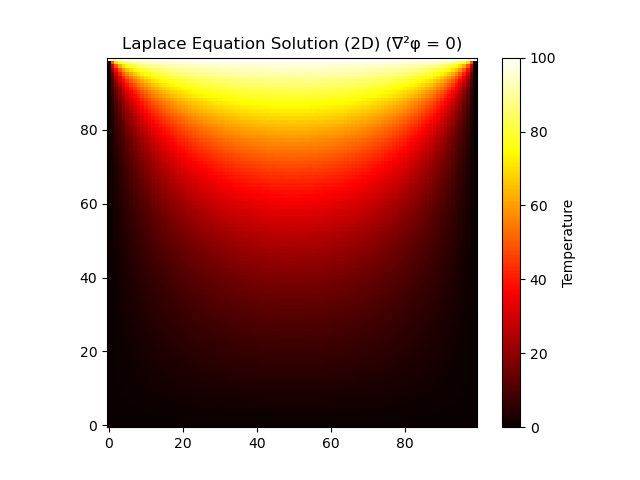
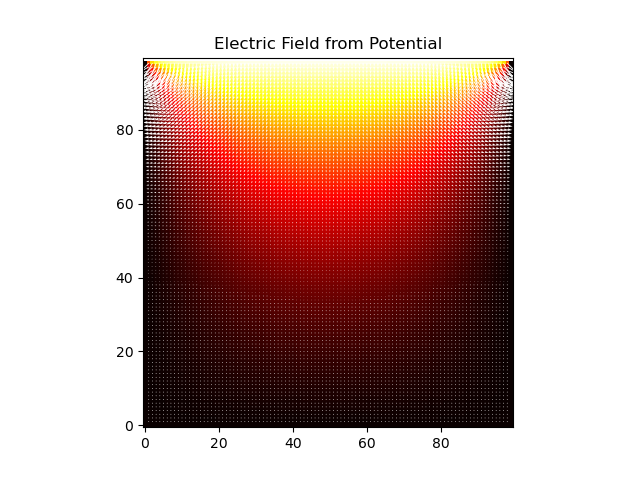

# laplace and poisson solver 2d

Numerical solution of the **Laplace equation** using **Jacobi** and **Gauss Seidel** method


## Mathematical background

### The 2D Laplace equation

$$
\nabla^2 \phi = \frac{\partial^2 \phi}{\partial x^2} + \frac{\partial^2 \phi}{\partial y^2} = 0
$$

### Finite difference discretization:

$$
\phi_{i,j} = \frac{1}{4} \bigl( \phi_{i+1,j} + \phi_{i-1,j} + \phi_{i,j+1} + \phi_{i,j-1} \bigr)
$$

## Poisson equation

$$
\nabla^2 \phi(x, y) = -S(x, y)
$$

Where:
- $\phi(x, y)$ = temperature distribution
- $S(x, y)$ = heat source term  
  (positive values generate heat inside the domain)

We discretize the Laplacian using **finite differences**:

$$
\phi_{i,j}^{new} = \frac{1}{4}\left(\phi_{i+1,j} + \phi_{i-1,j} +\phi_{i,j+1} + \phi_{i,j-1}-h^2 S_{i,j}\right)
$$

Where:
- $h$ is the grid spacing (set to 1.0 in this implementation)

## Example result (top_hot mode)

### Heat map

### vector field

### Animation


## poisson (circle_hot)
### Animation


The solver currently supports several boundary condition modes:
- ``top_hot`` (laplace) – The top boundary of the plate is heated while other sides are kept at zero temperature.
- ``center_hot`` (poisson) – A single hot point is placed at the center of the plate.
- ``circle_hot`` (poisson) – A circular hot region is placed at the center.
- ``sinusoidal_hot`` (laplace) – A sinusoidal temperature profile is applied along the top boundary.

## To run the program, type this following command in the terminal:
```bash
python3 main.py --solver[enter solver(default = gauss)] --nx [enter number of grid x (default = 50)]  --ny [enter number of grid y (default = 50)] --mode [enter mode (default = top_hot)]
```
for example:
```bash
python3 main.py --nx 50 --ny 50 --mode center_hot
```
